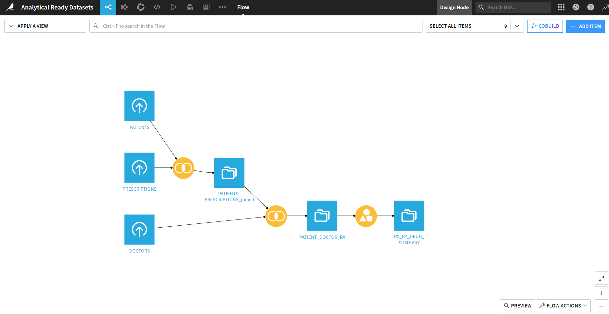
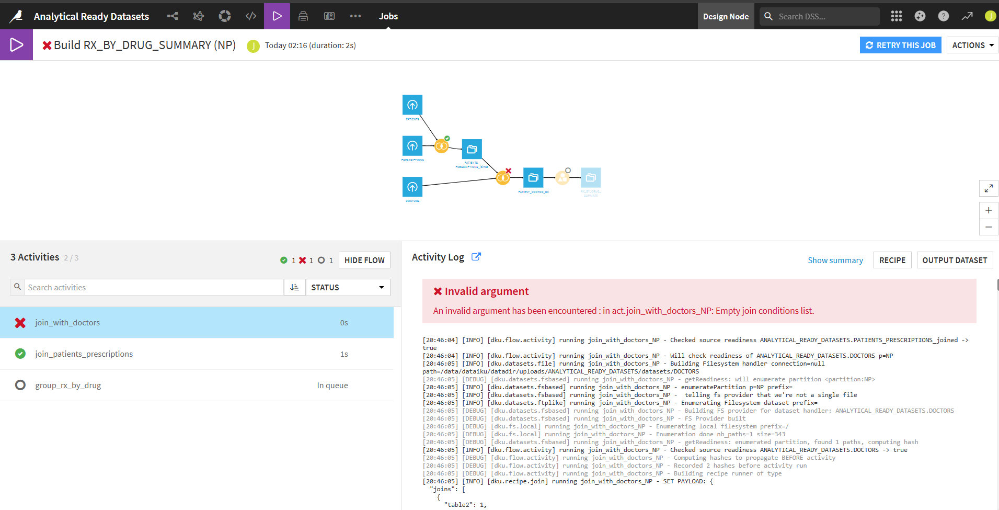
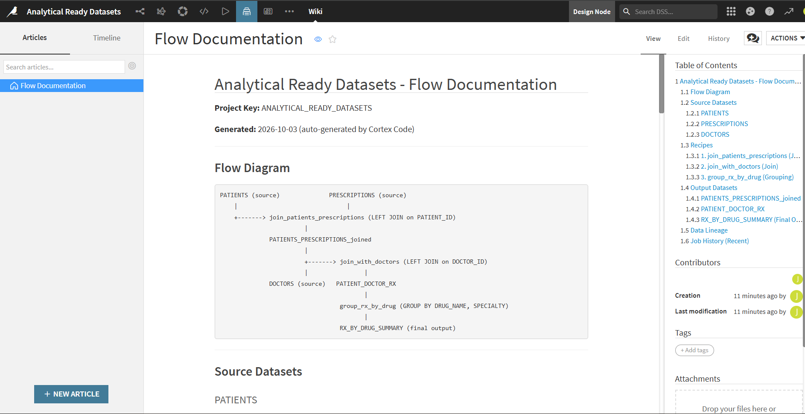

# dataiku-automations

Automations, scripts and project configuration for Dataiku DSS Projects.

## What's in this repo

- Python scripts that talk to Dataiku through its public API (`dataiku-api-client`)
- Automation scripts for building pipelines, debugging jobs, and generating documentation
- Flow documentation auto-generated from Dataiku project metadata
- Environment and setup notes for the Dataiku instance

## Repo structure

```
dataiku-automations/
├── README.md
├── .env                        # DSS_URL, DSS_API_ID, DSS_API_KEY (never commit real values)
├── setup_recipes.py            # Creates join + group recipes in Dataiku via Python API
├── fix_recipes.py              # Fixes join conditions on recipes
├── fix_group_recipe.py         # Fixes group-by keys and aggregations
├── fix_broken_recipe.py        # Repairs a broken join recipe (debug demo)
├── break_recipe.py             # Intentionally breaks a recipe for testing debug workflows
└── flow_documentation.md       # Auto-generated flow documentation for the project
```

## Project: Analytical Ready Datasets

**Project Key:** `ANALYTICAL_READY_DATASETS`
**Dataiku Instance:** `https://xxxx-dku.us-east-1.app.dataiku.io`
**Snowflake Account:** `<xxxx.com>` (database: `PHARMA_DEMO`)

### Pipeline overview

A pharma analytics pipeline that joins patient, prescription, and doctor data into a drug-level summary:

```
PATIENTS ──┐
            ├── join_patients_prescriptions ──> PATIENTS_PRESCRIPTIONS_joined
PRESCRIPTIONS ┘                                          |
                                                         ├── join_with_doctors ──> PATIENT_DOCTOR_RX
                                              DOCTORS ───┘           |
                                                          group_rx_by_drug ──> RX_BY_DRUG_SUMMARY
```

### Source data (Snowflake: PHARMA_DEMO.RAW)

| Table | Rows | Description |
|-------|------|-------------|
| DOCTORS | 5 | Doctor profiles with specialty and department |
| PATIENTS | 12 | Patient demographics, diagnosis, and assigned doctor |
| PRESCRIPTIONS | 18 | Prescription records with drug, dosage, and dates |

### Output

**RX_BY_DRUG_SUMMARY** — Prescriptions grouped by drug name and doctor specialty, with distinct patient count and prescription count per group.

## Getting started

### 1. Prerequisites

- A running Dataiku DSS instance (v15+)
- Python 3.9+ with `dataiku-api-client` installed
- A Snowflake account with `PHARMA_DEMO` database (or create it using the setup steps below)
- Cortex Code CLI (for automation demos)

### 2. Install dependencies

```bash
pip install dataiku-api-client
```

### 3. Configure access

Create a `.env` file with your Dataiku credentials:

```
DSS_URL=https://your-dss-instance.app.dataiku.io
DSS_API_KEY=dkuaps-your-api-key-here
```

Create the API key in Dataiku under your profile settings. Never commit `.env` with real values.

### 4. Create the Snowflake tables

The pharma demo data lives in `PHARMA_DEMO.RAW` on Snowflake. If it doesn't exist yet, create it using the SQL in Cortex Code or run the DDL manually (see flow_documentation.md for the schema).

### 5. Run the pipeline setup

```bash
python setup_recipes.py      # Creates 3 recipes in Dataiku
python fix_recipes.py         # Ensures join conditions are configured
python fix_group_recipe.py    # Configures group-by keys and aggregations
```

## Cortex Code automation capabilities

This repo demonstrates the following capabilities when using Cortex Code with Dataiku:

### 1. Build & run jobs
Trigger dataset builds (recursive or non-recursive) and monitor job status, timing, and activity-level results — all from the CLI.




### 2. Debug failed jobs
Inspect failed job logs, diagnose root causes (e.g., missing join conditions, bad column references), patch recipe settings via the Python API, and verify fixes by rebuilding.



### 3. Auto-generate documentation
Collect flow graph metadata, dataset schemas, recipe configurations, and job history to produce comprehensive flow documentation. See `flow_documentation.md`.



### 4. Data profiling & quality
Profile datasets for null rates, distinct value counts, value distributions, and numeric ranges to assess data quality without opening the Dataiku UI.

## License

TBD
